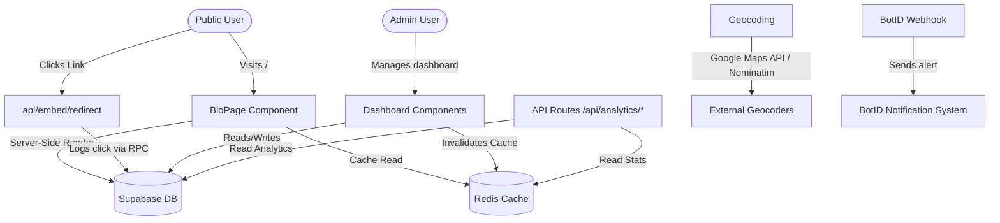

# Architecture

> Auto-generated by /map on 2026-06-11

## Overview

A dedicated bio-link and analytics platform designed specifically for **Reflection Photography**. The platform is a single-tenant Next.js application that showcases photography profile details, lists links categorized by main, location, or social types, tracks interactions, resolves geolocations, and provides a backend dashboard for managing settings, links, and analytics.

## Components

### Public Presentation Layer
- **BioPage (`app/page.tsx` & `components/bio/BioPage.tsx`)**
  - **Purpose:** Root public page composing background renderer, profile section, and categorized link sections.
  - **Location:** `app/page.tsx`, `components/bio/BioPage.tsx`
  - **Dependencies:** `BackgroundRenderer`, `ProfileSection`, `LinksSection`

- **BackgroundRenderer (`components/bio/BackgroundRenderer.tsx`)**
  - **Purpose:** Handles rendering dynamic and immersive backgrounds (gradients, solids, images, and videos).
  - **Location:** `components/bio/BackgroundRenderer.tsx`

- **ProfileSection (`components/bio/ProfileSection.tsx`)**
  - **Purpose:** Renders the user's avatar, business name, and location.
  - **Location:** `components/bio/ProfileSection.tsx`

- **LinksSection & LinkButton (`components/bio/LinksSection.tsx`, `components/bio/LinkButton.tsx`)**
  - **Purpose:** Group links by category (main, location, social) and render individual trackable button nodes.
  - **Location:** `components/bio/LinksSection.tsx`, `components/bio/LinkButton.tsx`

- **MapCard (`components/bio/MapCard.tsx`)**
  - **Purpose:** Shows location links integrated with static map previews.
  - **Location:** `components/bio/MapCard.tsx`

### Admin Dashboard Layer
- **Dashboard Pages (`app/dashboard/` etc.)**
  - **Purpose:** Restricted administration interface for profile management, links CRUD, and analytics views.
  - **Location:** `app/dashboard/`

- **LinksManager (`components/dashboard/LinksManager.tsx`)**
  - **Purpose:** High-level client component for links dashboard operations.
  - **Location:** `components/dashboard/LinksManager.tsx`

- **LinkForm & LinksList (`components/dashboard/LinkForm.tsx`, `components/dashboard/LinksList.tsx`)**
  - **Purpose:** Forms for updating/creating links and drag-and-drop sortable lists.
  - **Location:** `components/dashboard/LinkForm.tsx`, `components/dashboard/LinksList.tsx`

- **ProfileForm & BackgroundCustomizer (`components/dashboard/ProfileForm.tsx`, `components/dashboard/BackgroundCustomizer.tsx`)**
  - **Purpose:** Settings dashboard editors for updating metadata and background files/styles.
  - **Location:** `components/dashboard/ProfileForm.tsx`, `components/dashboard/BackgroundCustomizer.tsx`

- **AnalyticsPanel & MonthlyChart (`components/dashboard/AnalyticsPanel.tsx`, `components/dashboard/MonthlyChart.tsx`)**
  - **Purpose:** Renders metrics using Recharts.
  - **Location:** `components/dashboard/AnalyticsPanel.tsx`, `components/dashboard/MonthlyChart.tsx`

### Core & Services
- **Supabase Clients (`lib/supabase/`)**
  - **Purpose:** Houses configuration for client-side, server-side, and administrative service-role clients.
  - **Location:** `lib/supabase/client.ts`, `lib/supabase/server.ts`, `lib/supabase/admin.ts`

- **Caching Layer (`lib/cache/`)**
  - **Purpose:** Redis integration and in-memory fallback cache to accelerate analytics and stats responses.
  - **Location:** `lib/cache/redis.ts`, `lib/cache/monthlyStatsCache.ts`

- **Types (`types/index.ts`)**
  - **Purpose:** Common Type definitions for Profile, Link, LinkClick, BackgroundConfig, and MediaUpload objects.
  - **Location:** `types/index.ts`

---

## Data Flow

1. **Public Profile Loading**
   `app/page.tsx` fetches profile configurations and active links directly from Supabase (backed by Redis cache reading where applicable), renders `BioPage`, and serves the response.

2. **Link Redirection & Click Tracking**
   Public user clicks a link:
   - Navigates to `/api/embed/redirect?slug=...`
   - Redirection API runs the Supabase RPC `insert_click_if_not_exists` to deduplicate clicks per user within 24 hours.
   - Redirects to target URL.

3. **Analytics Tracking API**
   `POST /api/analytics/track` accepts client-side tracking calls for custom click events and persists them to `link_clicks` table.

4. **Monthly Analytics Dashboard Retrieval**
   Dashboard requests `GET /api/analytics/monthly`:
   - Checks Redis cache.
   - If miss, performs aggregation query on Supabase, populates Redis, and returns JSON data.

5. **Profile/Link Updates and Cache Invalidation**
   When administrator edits links or backgrounds:
   - Dashboard submits changes to Supabase via API.
   - Triggers `POST /api/analytics/refresh` to clear affected Redis/in-memory caches, guaranteeing instant public profile updates.

---

## Integration Points

| Service | Type | Purpose |
|---------|------|---------|
| **Supabase** | DB & Auth | Stores profiles, links, click logs; handles admin auth |
| **Redis** | Cache | Caches monthly statistics for performance |
| **Google Maps API** | API | Geocoding coordinates and generating static maps for location links |
| **Nominatim (OSM)** | API | Fallback geocoding service when Google Maps API is unavailable |
| **Cloudinary** | Storage | Hosts uploaded custom media (background videos, images, avatars) |
| **BotID** | Webhook | Delivers automated notifications for system health/actions |

---

## Technical Debt

- [ ] **Dual Router Architecture**: Concurrently runs App Router (`app/`) and Pages Router (`pages/api/`) for endpoints (favicon, ping, health, uploads).
- [ ] **Console Statements**: 68 leftover console logs/warns/errors in production paths.
- [ ] **TypeScript Types**: 114 instances of `any` and multiple `as any` casts.
- [ ] **Non-Distributed Cache Fallback**: In-memory `monthlyStatsCache.ts` resets on server restarts.
- [ ] **Missing Test Coverage**: Codebase only has Playwright snapshots; no unit or integration tests.
- [ ] **Unused Schema Validation**: Zod is installed but form inputs and API payloads are not fully validated.
- [ ] **Easter Egg Login Access**: Login page triggerable by public users clicking background 8 times.
- [ ] **Hardcoded Branding**: Single-tenant default values and references to "Reflection Photography" scattered in page templates.

---

## Conventions

- **Naming:** React components use PascalCase (e.g. `BioPage.tsx`), APIs and utilities use kebab-case or snake_case.
- **Structure:** Features organized into standard Next.js directory hierarchy.
- **Testing:** End-to-end tests stored under `tests/`.
